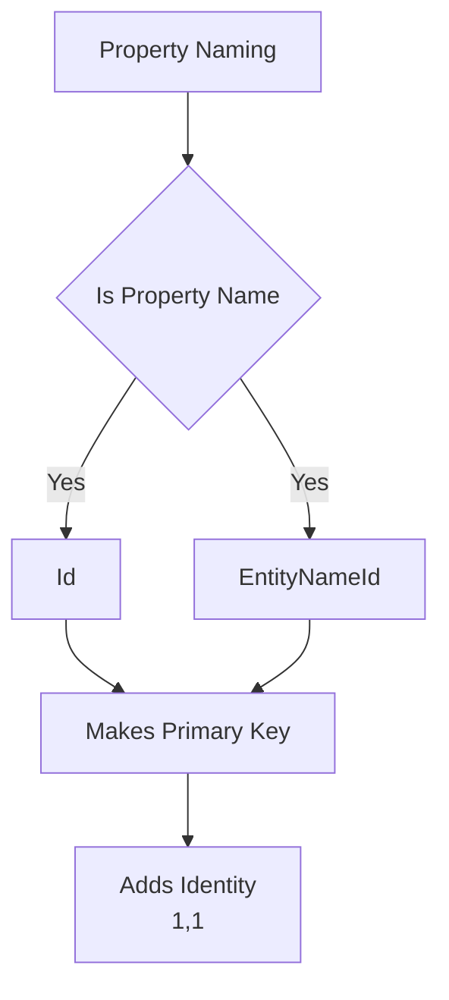

# Entity Framework Core - Mapping by Convention

## Project Structure
```
ProjectName/
├── Domain/
│   └── Entities/  # or Models
│       └── Employee.cs
```

## POCO Classes (Plain Old CLR Objects)

POCO classes are simple classes without any special functionality or behavior, used for mapping to database tables.

```csharp
namespace Day_02_G02.Entities
{
    internal class Employee
    {
        public int Id { get; set; }
        public string Name { get; set; }
        public double Salary { get; set; }
        public int? Age { get; set; }
    }
}
```

## Mapping by Convention

Entity Framework Core follows specific conventions for mapping classes to database objects.

### Primary Key Conventions


| Property Pattern | Example | Result |
|-----------------|---------|---------|
| `Id` | `public int Id` | Primary Key |
| `EntityNameId` | `public int EmployeeId` | Primary Key |

### Data Type Mapping

| C# Type | Nullability | SQL Server Type | Constraint |
|---------|------------|-----------------|------------|
| `int` | Not Nullable | `int` | Required |
| `string` (.NET 5) | Reference Type | `nvarchar(max)` | Optional |
| `string` (.NET 6+) | Reference Type | `nvarchar(max)` | Required |
| `string?` (.NET 6+) | Nullable Reference | `nvarchar(max)` | Optional |
| `double` | Value Type | `float` | Required |
| `int?` | Nullable Value | `int` | Optional |

## Default Conventions

1. **Primary Key**
   - Auto-detection of `Id` or `{EntityName}Id`
   - Automatic identity specification (1,1)

2. **Nullability**
   - Value types: Not nullable by default
   - Reference types (.NET 5): Nullable by default
   - Reference types (.NET 6+): Not nullable by default
   - Explicit nullable types (`string?`, `int?`): Always nullable

3. **String Properties**
   - Maps to `nvarchar(max)`
   - Nullability based on type declaration

4. **Numeric Properties**
   - Integer types map to `int`
   - Floating-point types map to `float`
   - Precision based on C# type

## DbContext Setup Requirements

To complete the mapping:
1. Create a DbContext class
2. Include DbSet properties
3. Configure connection string
4. Register with dependency injection (if using ASP.NET Core)

```csharp
// Basic DbContext structure (to be expanded)
public class ApplicationDbContext : DbContext
{
    public DbSet<Employee> Employees { get; set; }
    // Connection string configuration to be added
}
```

## Best Practices

1. **Project Organization**
   - Keep entity classes in dedicated folder
   - Use clear naming conventions
   - Group related entities together

2. **POCO Design**
   - Keep entities simple
   - Avoid business logic in entities
   - Use appropriate data types

3. **Conventions**
   - Follow EF Core naming conventions
   - Be consistent with nullability
   - Document any deviations

4. **Migration Considerations**
   - Plan for future changes
   - Consider column size constraints
   - Think about indexing requirements
